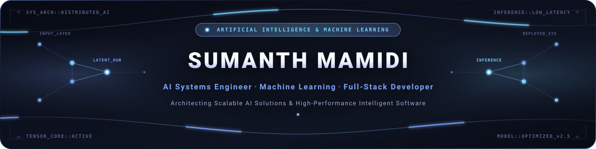

<!-- ========================= -->
<!--      GITHUB PROFILE      -->
<!-- ========================= -->

  

  

---

<h2 align="center">💫 About Me</h2>

<table align="center">
  <tr>
    <td>
      🔭 I am currently working on <b>AI-powered real-world applications</b> and <b>Full-Stack projects</b>. 
      🤝 I am looking to collaborate on <b>AI/ML, Open Source</b>, and <b>Innovative Software Projects</b>. 
      🛠️ I am looking for help with <b>System Design, MLOps</b>, and <b>Scalable AI Solutions</b>. 
      📚 I am currently learning <b>Advanced AI/ML, Deep Learning, LLMs</b>, and <b>Cloud Technologies</b>. 
      💬 Ask me about <b>Python, AI/ML, Computer Vision, Full-Stack Development</b>, and <b>Hackathons</b>. 
      ✨ Fun fact: <b>I love turning crazy ideas into real working products.</b>
    </td>
  </tr>
</table>

---

<h2 align="center">🌐 Socials</h2>

  
  
  

---

<h2 align="center">💻 Tech Stack</h2>

<h3 align="center">💻 Languages</h3>

  
  
  
  
   
  
  
  

<h3 align="center">🤖 AI / Machine Learning</h3>

  
  
  
  
  

<h3 align="center">⚙️ Frameworks & Libraries</h3>

  
  
  
   
  
  
  
  

<h3 align="center">🗄️ Databases & Cloud</h3>

  
  
  
  
   
  
  
  
  

<h3 align="center">🛠️ Tools</h3>

  
  
  
  

---

<h2 align="center">📊 GitHub Stats</h2>

   
   
  

---

<h2 align="center">📈 Activity & Contribution Timeline</h2>

  

  

---

<!-- UNIFIED FOOTER: Perfectly balanced spacing, no extra lines -->

  

    <i>"First, solve the problem. Then, write the code."</i> 
    <b>— John Johnson</b>
  

  

    
  

  

    <i>"See you in the next commit."</i> 
    Built with ❤️, curiosity, and countless cups of coffee.
  

